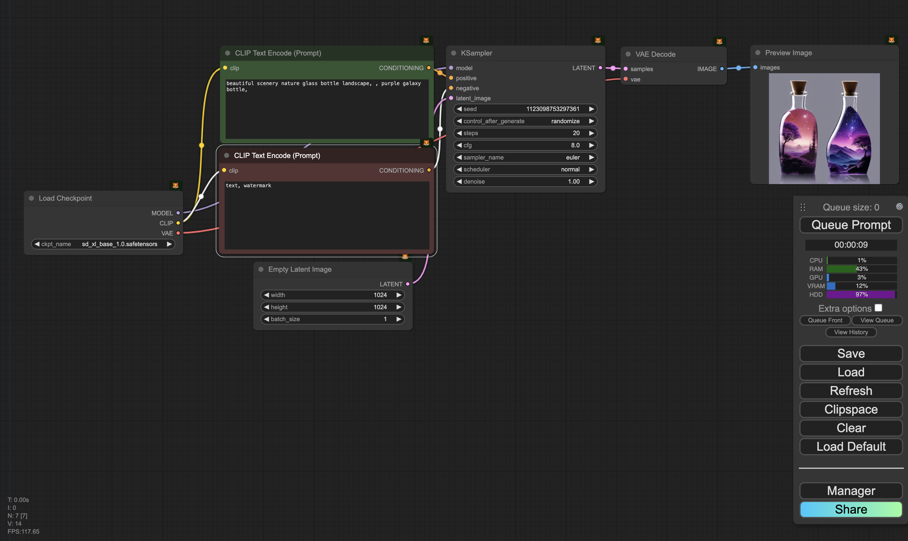

# COMFYUI

ComfyUI is a graphical user interface for interfacing with stable diffusion models. It is pretty easy to install and use, you can find the documentation on their github page [here](https://github.com/comfyanonymous/ComfyUI). It is capable of running on both Mac and Windows operating systems. For this workshop, we will wont install it, but we will use the pre-installed version on two servers that we have access to. To Access the server, visit any of the following links:

- [Server 1](http://172.28.146.129:8188/)
- [Server 2](http://172.28.146.91:8188/)

The models we would be using would be [StabilityAI](https://stability.ai/)'s SDXL models. There are a lot of online repositories for models that are pre-trained and ready to use. One of the most popular is [HuggingFace](https://huggingface.co/models) and another is (Civit.ai)[https://civit.ai/]. Feel free to explore these repositories and try out the different models available.

I have available a number of pre-saved workflows to test out using ComfyUI. You can find them in this shared [Drive](https://drive.google.com/drive/folders/1IXD8-pphq0y7SllwDHT0V2HiMDXo8Hna?usp=sharing). Remember that when you make you workflow and save the images from ComfyUI, it embeds the workflow in the image. You can then share the image with others and they can load the workflow into their ComfyUI.
